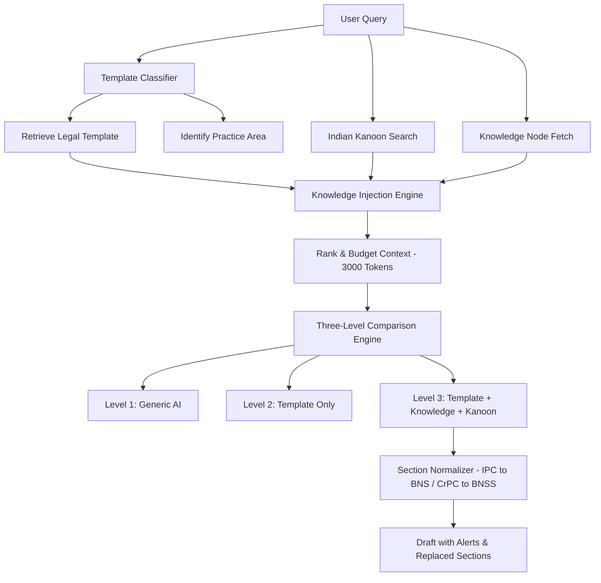

# Architecture: BRAHMO India Legal (Option C - Criminal + Corporate)

This document details the system design, data flow, and processing pipeline for **BRAHMO India Legal – Option C (Criminal + Corporate)**.

## System Overview

BRAHMO India Legal is a legal drafting and analysis platform. It leverages AI combined with local statutes (IPC/BNS & CrPC/BNSS mapping structures), enterprise knowledge management (knowledge nodes), and live legal research query tools (Indian Kanoon case lookup) to output high-fidelity, compliant legal drafts.

## Core Pipelines

### 1. Template Classification Pipeline
- Uses regex keyword match falling back to LLM semantic search.
- Classifies query into:
  - `practice_area` (Criminal / Corporate)
  - `document_type` (e.g., Bail Petition, WS, Winding-up, Cheque Bounce, Board Resolution, Arbitration Notice)
  - `court_type` (Supreme Court, High Court, Sessions/District, NCLT)

### 2. Knowledge Injection Pipeline
Matches relevant nodes from `knowledge_nodes`.
- Parses structural markers: `{INJECTION_CONSTRAINTS}`, `{INJECTION_DECISIONS}`, `{INJECTION_CLIENT}` inside system prompts.
- Employs Priority Ranking:
  1. **Constraints** (Strict guidelines e.g. "Do not assert X unless Y is present")
  2. **Anti Patterns** (Avoid clauses or mistakes)
  3. **Decisions** (Precedential directives)
  4. **Client Facts** (Direct user details)
- Applies a hard token limit of **3000 tokens** via character counts (approx. 4 chars per token) to prevent model context blowout.

### 3. Section Normalizer
- Detects sections (e.g. "Section 420 IPC", "Section 302 IPC", "Section 438 CrPC").
- Replaces them with the equivalent sections in the new criminal codes:
  - **IPC (Indian Penal Code)** $\rightarrow$ **BNS (Bharatiya Nyaya Sanhita)**
  - **CrPC (Code of Criminal Procedure)** $\rightarrow$ **BNSS (Bharatiya Nagarik Suraksha Sanhita)**
- Returns:
  - Cleaned text.
  - Replaced mappings dictionary.
  - Array of user alerts warning of legal implications (e.g., change in sentencing ranges or bail eligibility constraints).

### 4. Evaluation & Score Rubric
Provides a quality index for each comparison Level:
- **Level 1 (Generic AI)**: Average score (40-60%). Lacks court header rules and citation validation.
- **Level 2 (Template-Only)**: Good score (60-80%). Fits general structural requirements but lacks case laws or facts.
- **Level 3 (Full Engine)**: Highest score (85-98%). Integrates template formats, section corrections, verified precedents, and client constraints.
